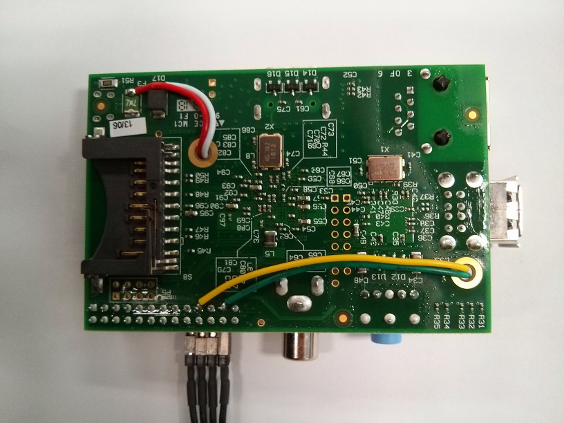
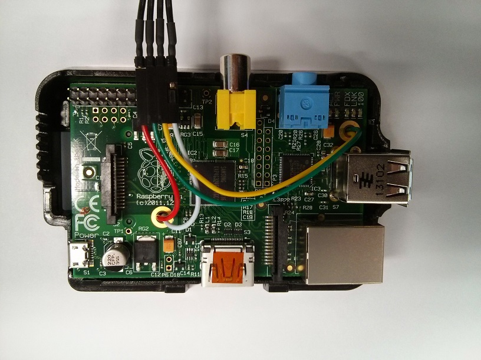

# Hardware

It's a somewhat simple task to build the Raspberry Pi with the lights.

Some soldering experience will definitely help but don't feel discouraged: below you will find everything you need, just read through.

#### Components

* 8 GB SD card (or Micro SD if you are using Raspberry Pi 3)
* [Raspberry Pi with enclosure and SD card](https://www.adafruit.com/products/3055)
* [Digital RGB LED Weatherproof Strip LEDs](https://www.adafruit.com/products/306)
* [4-pin JST SM Plug + Receptacle Cable Set](http://www.adafruit.com/products/578)
* **Only for Raspberry Pi 2** [Miniature WiFi module (802.11b/g/n)](https://www.adafruit.com/product/814)
* [5V 2A \(2000mA\) UL Listed switching power supply](https://www.adafruit.com/products/276)
  * _Warning: We need at least 3A power supply, but this will do as long as the lights are ___NOT___ on full brightness all at the same time_
* [Micro USB to 5.5mm female DC jack \(Part Number: VUPN7718\)](http://www.vetco.net/catalog/product_info.php?products_id=14954)
* 4-pin 0.1" \(2.54mm\) pitch male header
* 4 jumper wires \(Black, Red, Yellow, Green\) or 4 wires with 4-way 0.1" pitch female connector
* **Optional** dual schmitt trigger buffer, e.g. SN74LVC2G17 or 2
  \*SN74LVC1G17 \(for Pi IO pins protection\)
* 1\/16" \(1.6mm\) and 3\/32" \(2.4mm\) Heatshrink
* [Master Image to be written to the microSD card](https://s3-ap-southeast-2.amazonaws.com/dius-build-lights-assets/build-lights-master-20161205.zip) (optional)

#### Instructions for the hardware

The Raspberry Pi is fitted with a polyfuse at the USB 5V rail. You'll need to tap the 5V from the input side of the polyfuse (the photos below are from the Raspberry Pi 2).

When soldering the 4-pin JST SM Plug to the LED strip, make sure to solder it on the input side of the strip \(input is marked with DI, CI\).

If you want protection for the Pi SPI pins, include the schmitt trigger buffer along the 2 SPI lines and power the buffer from the 5V that was tapped earlier \(before the polyfuse\).

